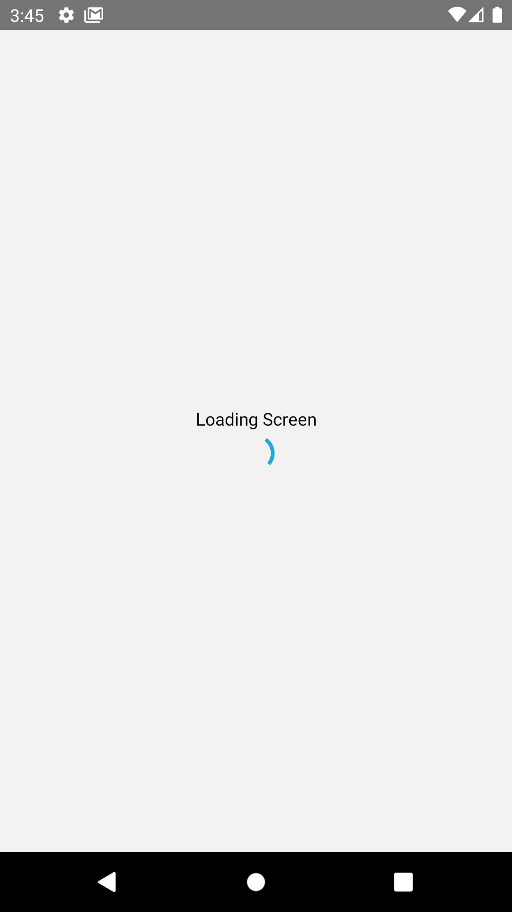
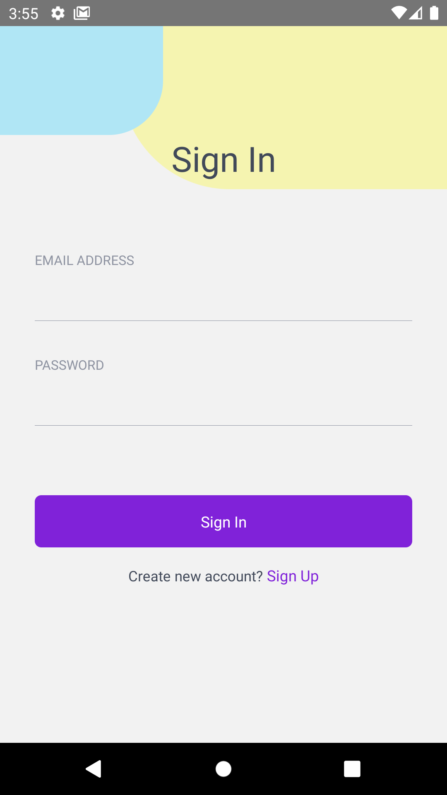
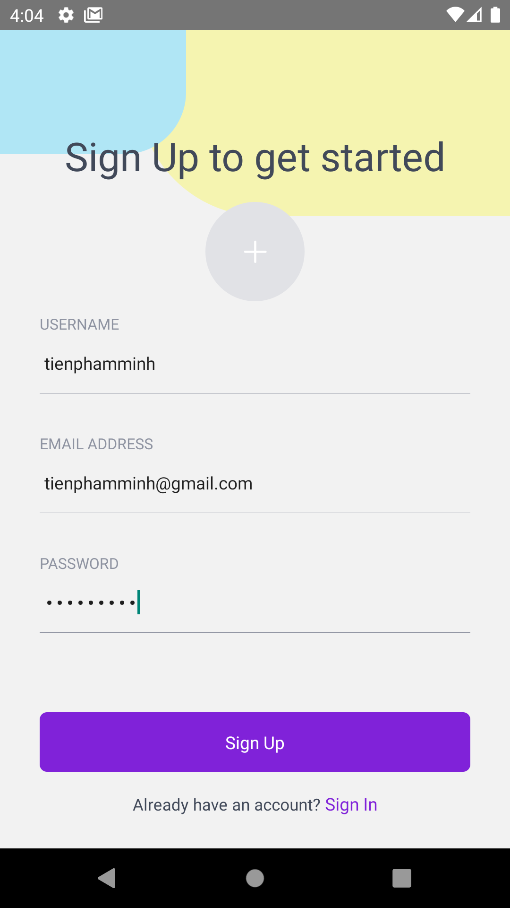
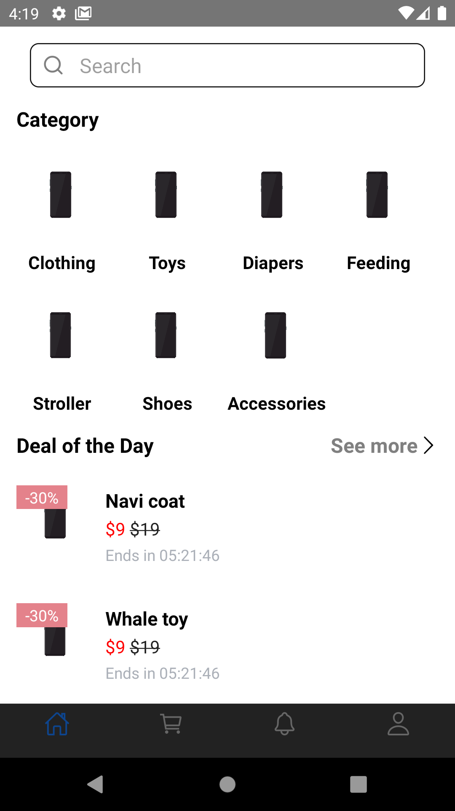
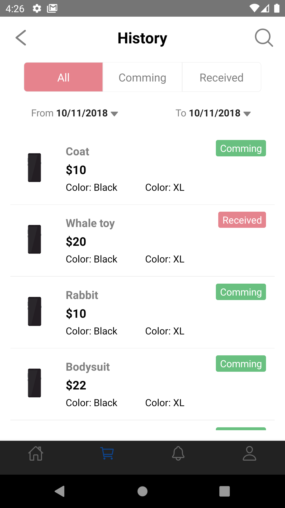

# SE05 - Group20

# Instructor: Bui Sy Nguyen - Founder and CEO of House3D

# Project: Online Shopping App

### Introduction
- A shopping app that has features like: display products and shopping cart, user authentication, and Firebase integration. It works well with both IOS and Android.
- The objectives of the project are as follows:
  - Promoting a service or product online.
  -	Selling a service or product.
  -	Providing product support or customer service.
  -	Providing store information.

### Prerequisites
Before you continue, ensure you have installed the following dependencies:
- Node.js (v15.0.0)
- Java SE Development Kit 8 (JDK 8)
- Android Studio for setting up the necessary tooling to build your React Native app for Android. (by default, Android Studio installs the latest Android SDK. Building a React Native app with native code, however, requires the Android 10 (Q) SDK in particular.)
- You can use any editor of your choice to develop your app, we recommend using Visual Studio Code
See detail at: [https://reactnative.dev/docs/environment-setup](https://reactnative.dev/docs/environment-setup)

### Installation
1. **Download ZIP or clone and open it in Android Studio**
2. **Preparing the Android device**
- *Using a physical device:* Plug your physical Android device in to your computer using a USB cable.
- *Using a virtual device:* If you have recently installed Android Studio, you will likely need to create a new Android Virtual Device (ADV).
3. **Running app**
- Inside your Shopping App project folder, open cmd and run the command below:
```
npx react-native start
```
- Wait a few minutes, open new cmd and run:
```
npx react-native run-android
```
 4. **Create new Firebase project and add Firebase SDK to ShopApp\src\config\firebase.js**
 
 ### Demo:
 1. **Loading screen**
 <p></p>
 
 Loading Screen contains Text or Images that shows when the app first starts. It is used when the mobile app requires essential information before its start. The application may load the information from some external API or local storage.
 
 2. **Sign in, sign up screen**
 
 
 Users need to enter their registered email and password to access the system. If you don't have an account, click at ``Create new account? Sign Up``
 
 
 
 When you register successfully, the data will be entered into Firebase Authentication:
 
 3. **Home screen**
  
  
  Display product categories and deal of the day
  
 4. **Cart screen**
 
 
 ### References:
 [https://reactnative.dev/docs/getting-started](https://reactnative.dev/docs/getting-started)
 
 [https://reactnavigation.org/blog/2020/02/06/react-navigation-5.0/](https://reactnavigation.org/blog/2020/02/06/react-navigation-5.0/)
 
 [https://youtu.be/IXw8nRv7TBU?list=PLqtWgQ5BRLPvaAnoiZD8_z2RTh1VYVqN2](https://youtu.be/IXw8nRv7TBU?list=PLqtWgQ5BRLPvaAnoiZD8_z2RTh1VYVqN2)

 [https://www.youtube.com/watch?v=xDHjab0MPTA&t=409s](https://www.youtube.com/watch?v=xDHjab0MPTA&t=409s)
 
 ### Contributors
 [tienphamminh]() - Phạm Minh Tiến - 18001075
 
 [thanhH99]() - Nguyễn Xuân Thành - 18001078
 
 [ducthinh1402]() - Trần Đức Thịnh - 18001080
 
 [NguyenXuanDuan]() - Nguyễn Xuân Duẩn - 18001027
